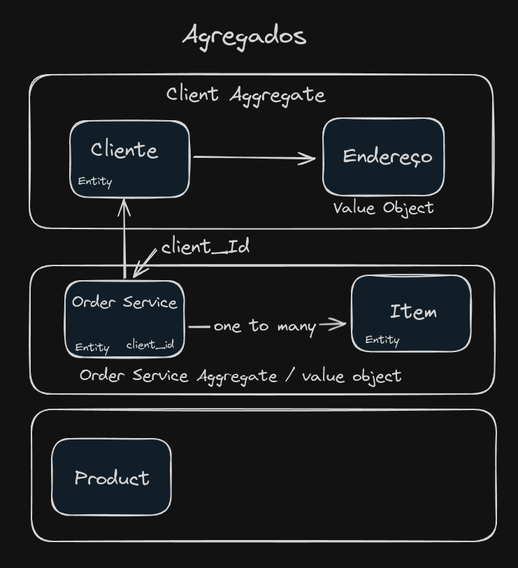

para rodar os testes execute

docker compose up -d
yarn test ou npm test

se não executar o comando `docker compose up -d` vai da erro de conexão

```bash
FAIL  src/infrastructure/order/repository/sequilize/order.repository.spec.ts
  ● Order repository test › should create a new order

    SequelizeConnectionRefusedError: connect ECONNREFUSED 127.0.0.1:5432
```


